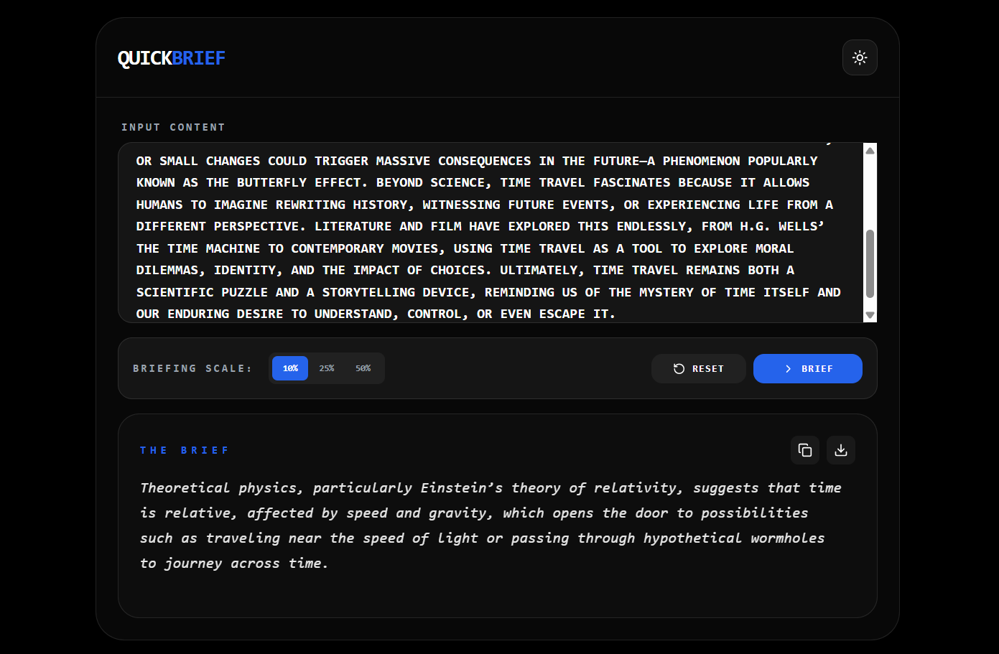

QuickBrief is a text summarizer built with React and TailwindCSS. It generates concise summaries from any text using an adjustable briefing scale. Supports dark/light mode, copy/download features, and responsive modern UI.

Live Demo: (https://quickbrief-react.vercel.app/)

Features:
- Adjustable briefing scale: 10%, 25%, 50%
- Dark and light mode toggle
- Copy or download summary
- Loading animation during processing
- Responsive and modern UI

Installation:
git clone https://github.com/gautamsonpitale17/quickbrief-react
cd quickbrief-react
npm install
npm start

Usage:
- Paste text into the input box
- Select briefing scale
- Click "Brief" to generate summary
- Copy or download the summary
- Reset to start over

Tech:
React | TailwindCSS | Lucide Icons
